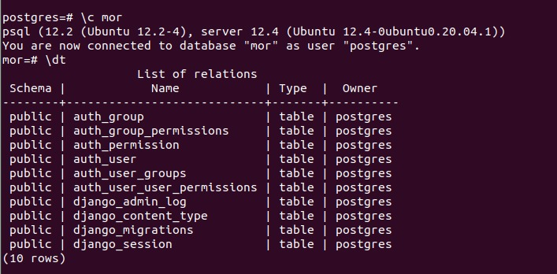

# postgresql_tutorial

## Installing postgres on ubuntu 20.04

to update and upgrade packages

```
$ sudo apt update
$ sudo apt -y upgrade
```
to Install PostgreSQL on Ubuntu 20.04
```
$ sudo apt install postgresql postgresql-client
```
After completing the installation of PostgreSQL, you will start, stop, and enable the PostgreSQL services using the following command:
```
$ sudo systemctl stop postgresql.service
$ sudo systemctl start postgresql.service
$ sudo systemctl enable postgresql.service
```

Now, to verify the PostgreSQL service status that either it is running on your system or not. Use the following command to check the service status:
```
$ sudo systemctl status postgresql.service
```

Setting PostgreSQL user password:
```
sudo passwd postgres
```


##Access PostgreSQL shell

PostgreSQL has been installed on your system. Now, you will log in to PostgreSQL as a user to access the databases and working shell using the following command:
```
$ sudo su -l postgres
$ psql <dbname>
```
default db is postgres.

Use the following command to list databases:
```
$ psql -l
```

Creating a database and user roles:

creating a db:
```
postgres=# create database testdb;
```
moving inside a database:
```
postgres=# \c testdb
```


listing tables and sequences:
```
postgres=# \d
postgres=# \dt
postgres=# \da
```

after u enter into a db
you can start executing commands:
```
testdb=# alter user postgres with password 'my00pass';
```
creating a user:
```
postgres=# create user john with encrypted password 'mypass';
```
giving a user privileges:
```
testdb=# grant all privileges on database testdb to john;
```

creating a db:(syntax)
```
CREATE TABLE new_table_name (
	table_column_title TYPE_OF_DATA column_constraints,
	next_column_title TYPE_OF_DATA column_constraints,
	table_constraint
	table_constraint
) INHERITS existing_table_to_inherit_from;
```

Column definitions follow this syntax pattern:
```
column_name data_type (optional_data_length_restriction) column_constraints
```
The column name should be self-explanatory.
Example:
```
CREATE TABLE pg_equipment (
	equip_id serial PRIMARY KEY,
	type varchar (50) NOT NULL,
	color varchar (25) NOT NULL,
	location varchar(25) check (location in ('north', 'south', 'west', 'east', 'northeast', 'southeast', 'southwest', 'northwest')),
	install_date date
	);
  ```
  for more details on DDL commands in postgresql  [click here](https://www.digitalocean.com/community/tutorials/how-to-create-remove-manage-tables-in-postgresql-on-a-cloud-server)
